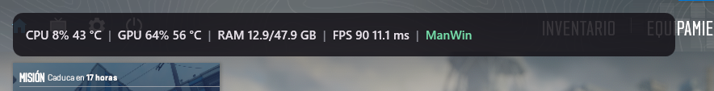
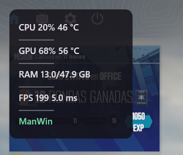

# ManWin Performance Overlay

ManWin es un overlay de rendimiento para Windows, inspirado en MangoHud y diseñado para mostrar información útil mientras juegas sin salir de la partida.

## Características

- Overlay transparente, click-through y siempre visible sobre el juego.
- Selección manual del juego o aplicación que se desea medir.
- CPU: carga y temperatura.
- GPU: carga y temperatura.
- RAM física utilizada y total del sistema.
- FPS y frametime mediante eventos ETW de Windows.
- Orientación horizontal o vertical.
- Interfaz de configuración con Material Design 3 y soporte español/inglés.
- Lectura de sensores mediante LibreHardwareMonitor.
- Instalación opcional de PawnIO para sensores que requieren acceso de bajo nivel.

## Capturas

### Overlay horizontal

### Overlay vertical

## Requisitos

- Windows 10 o posterior.
- Ejecutar `ManWin.exe` como administrador.
- Abrir los juegos en modo ventana o borderless para obtener la mejor compatibilidad visual.

## Uso

1. Descarga el paquete de la sección **Releases**.
2. Extrae todos los archivos en una carpeta.
3. Ejecuta `ManWin.exe` como administrador.
4. Selecciona el juego objetivo desde el Dashboard y pulsa el botón de enlace.
5. Abre **OSD Design** para activar métricas y elegir orientación.

PawnIO es opcional. Si la temperatura del CPU no aparece, ManWin puede ofrecer instalarlo mostrando antes una advertencia sobre sus permisos y compatibilidad con anti-cheat.

## Tecnologías utilizadas

- **C# y .NET 9 WPF** para la aplicación de Windows.
- **ETW / Microsoft-Windows-DxgKrnl** para contar eventos de presentación y calcular FPS/frametime.
- **LibreHardwareMonitor** para las métricas de CPU, GPU y memoria.
- **PawnIO** como opción para sensores de bajo nivel.
- **WebView2** para la interfaz de configuración.
- **Beer CSS / Material Design** como base visual de la interfaz.

## Distribución

Este repositorio publica únicamente el paquete compilado para usuarios finales dentro de `release/` y el archivo ZIP adjunto a cada release. El código fuente no forma parte de la distribución pública.

## Licencias

ManWin utiliza componentes de terceros, incluyendo LibreHardwareMonitor, Microsoft WebView2 y Beer CSS. Consulta sus licencias y avisos correspondientes antes de redistribuir el paquete.
