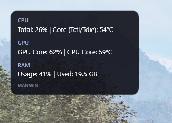
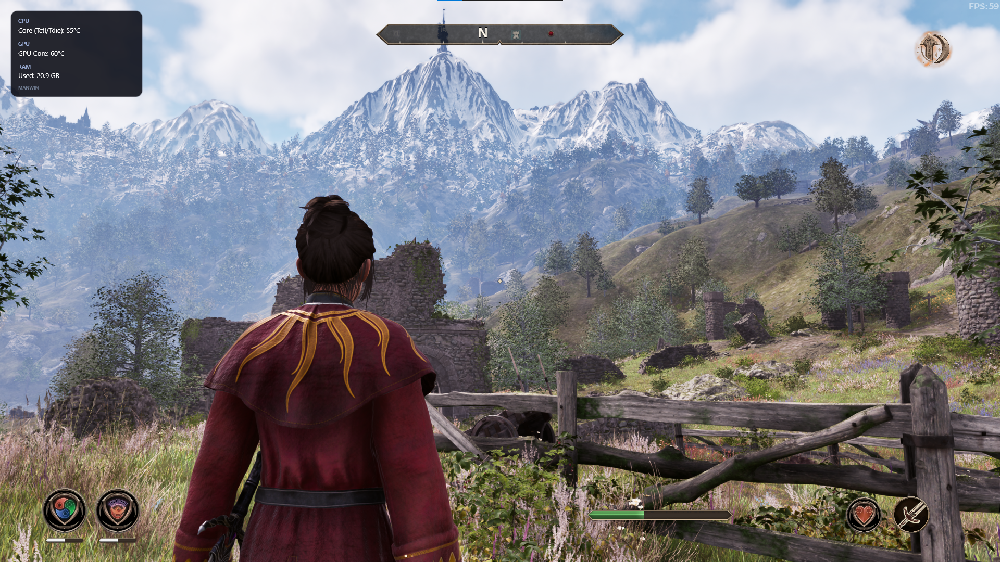

# ManWin

ManWin is a lightweight Windows hardware-monitoring app with a configurable on-screen display (OSD). Choose the metrics you want to see, then keep the OSD running while the Metrics window is minimized to the notification area.

## Screenshots

The screenshots show ManWin's OSD over a game. The FPS counter visible in the game screenshots belongs to the game's own overlay; ManWin does not currently provide an FPS metric.






## Features

- Select available CPU, GPU, and memory metrics.
- Show selected readings in a transparent, click-through OSD.
- Minimize the Metrics window to the Windows notification area while the OSD and sensor polling continue.
- Restore Metrics by double-clicking the notification-area icon or choosing **Open Metrics**.
- Save metric selections between runs.

Available readings depend on the hardware and sensors exposed by OpenHardwareMonitorLib. ManWin polls sensors once per second. The current implementation does not include FPS measurement.

## Requirements

- Windows 10 or Windows 11, x64.
- Microsoft Edge WebView2 Evergreen Runtime. It is commonly installed on Windows 11. If it is missing, install it from the [official WebView2 page](https://developer.microsoft.com/microsoft-edge/webview2/).
- .NET 9 SDK to build and run from source. The portable publish includes the .NET runtime, so end users do not need to install .NET separately.

## Build and run from source

Run these commands from the repository root.

### PowerShell

```powershell
dotnet restore .\ManWin\ManWin.csproj
dotnet build .\ManWin.sln
dotnet run --project .\ManWin\ManWin.csproj
```

### Git Bash

Use forward slashes in paths:

```bash
dotnet restore ./ManWin/ManWin.csproj
dotnet build ./ManWin.sln
dotnet run --project ./ManWin/ManWin.csproj
```

You can also open `ManWin.sln` in Visual Studio 2022 with the **.NET desktop development** workload and run the `ManWin` project.

## Create a portable Windows x64 build

From PowerShell, run:

```powershell
dotnet publish .\ManWin\ManWin.csproj -c Release -r win-x64 --self-contained true -o .\artifacts\ManWin-portable
Compress-Archive -Path .\artifacts\ManWin-portable\* -DestinationPath .\artifacts\ManWin-win-x64.zip -Force
```

From Git Bash, use forward slashes for the publish command:

```bash
dotnet publish ./ManWin/ManWin.csproj -c Release -r win-x64 --self-contained true -o ./artifacts/ManWin-portable
```

The portable output is a folder containing the executable, .NET runtime, dependencies, icon, and web assets. Distribute the whole folder, or create a ZIP from its contents. WebView2 Evergreen Runtime must still be installed on the target computer. The app stores preferences in `%LOCALAPPDATA%\ManWin\settings.json`.

## Usage

1. Toggle the metrics you want to display.
2. Select **Save** to store your selections.
3. Minimize the Metrics window or click **X** to hide it in the notification area. The OSD and sensor polling continue running.
4. Double-click the ManWin notification-area icon or select **Open Metrics** to restore the window. Select **Exit ManWin** from the tray menu to close the app and stop the OSD.
5. Drag the top bar to move the Metrics window.

## Project structure

- `ManWin/` — WPF app and WebView2 host.
- `ManWin/Sensors/` — sensor-reading contract and OpenHardwareMonitorLib provider.
- `ManWin/wwwroot/` — HTML, CSS, and JavaScript for the Metrics page.
- `docs/screenshots/` — screenshots shown above.

## Support

[](https://buymeacoffee.com/strelok_dev_8612)

## Dependencies and notices

The app uses `OpenHardwareMonitorLib` 1.0.9513 and `Microsoft.Web.WebView2`, both referenced through NuGet. OpenHardwareMonitorLib is licensed under MPL-2.0 and includes third-party dependencies; see the package and upstream project for applicable notices. Some low-level readings are hardware-dependent and may require elevated permissions. ManWin does not automatically request administrator privileges.
